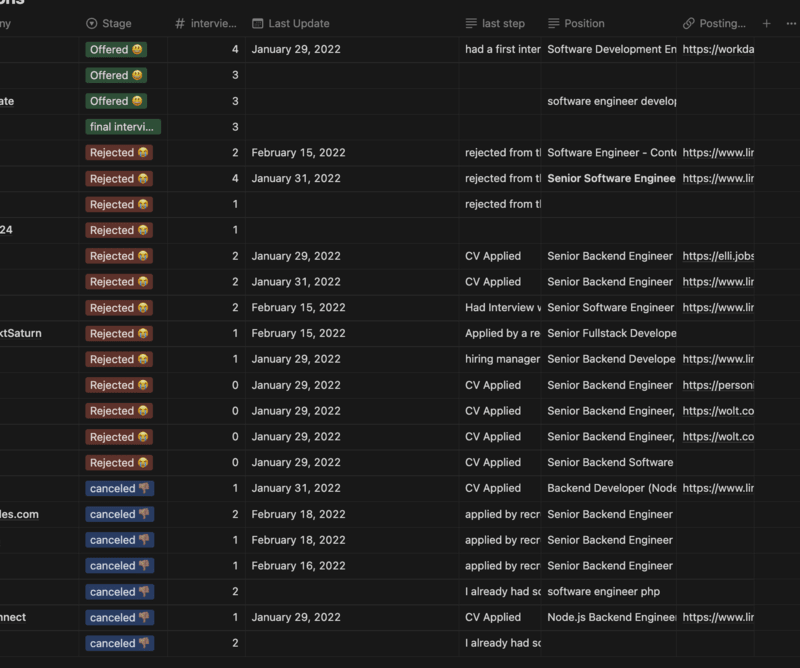

I have been working as a software engineer since 2015, jumped between different jobs 2 in Germany and a few more in Egypt and I think finally I found my best strategy to hunt a new job. 

The interview process is a series of steps in most cases there are four steps: 
- CV evaluation 
- Recruiter Interview 
- Technical Interview(s)
- Manager Interview 

But first, let's talk about a few general things that helped me in every step.
- **🏃🏽‍♂️ sprints 🏃🏽‍♂️**
	I know it's weird to put [scrum sprints](https://www.scrum.org/resources/what-is-a-sprint-in-scrum) into my job-hunting process but remember the sprints are used for having feedback to improve the product, in this case, my job application, so I would apply for some jobs for one week or so when I have enough application submitted I would consider this is enough for this sprint and would carry the interviews that comes out of these applications first and I would consider applying again only after I get enough feedback that can improve my application further. 

- **✨ Logging ✨** 
  The more data you collect about your job applications the more room you have to improve your future applications this can be done simply by having a table, Excel or notion, or even .txt files, for me I used notion to sort all my applications like [this](https://mustafah15.notion.site/Job-Applications-template-6de7f53d0d1d4b4bb2ceb020586b467b?pvs=4) this page(template) has the everything I needed to Log my applications in one sprint I would add the CV version I used to apply to those applications as well as a table that have every single application I have sent including company name, title, number of interviews, date of last update I got on this application, posting URL, some notes that I might need to review later and which state my application is in or ended in this should give me more clarity which step I need to improve for example if I fail more than 40% in the CV evaluation step that is a clear indicator that I might need to update my CV to have a lower rejection rate in this step.
  Also, with every company I interview with I would have notes about the company market, industry competitors, salary ranges for a similar position, and why this might be this role would be a good fit for me this would help during the interview process with that company.
  
	 
### CV Evaluation 📑
My CV is very minimal I would say it has my contact information and my previous experience which I think is the most important part to state every job I worked at and my role, responsibilities, achievements, and maybe the tools I used to achieve my goals in that job. Most of the time the CVs are reviewed first by automated tools so it's important that you test your CV against one of them before you start to apply for jobs I have tried [enhancecv.com](https://enhancv.com/) there are more tools like this just search for ATS resume checker which should give a rough idea if the CV is good enough. Also, you can hire a human who can review your current CV and update it for you and you just tell them your experience/story and they come out with the best CV format for you I used such a service once before I move to Germany.
	
### Recruiter Interview 🤓
This is the screening step where the company recruiter tries to make sure that I as a candidate would be a good fit for the company profile, so they should ask for more clarification about my experience about anything that might need more clarification and might be not covered in the CV. 
	
### Technical Interview 👨🏽‍💻
In my opinion, I think this somehow depends on what the company needs from me as a developer and what skills I have if what the company needs matches the skills that I have, I will be able to pass this step. Also, I should definitely search for what type of technical interview I will have to help myself to prepare for it, problem-solving? system design? code kata? every type has its own examples and its own exercise that would help me to be prepared for it. 
	
### Manager Interview 👨🏻‍💼
This for me was the hardest part of the interview process as I find it a bit hard to show off my skills and present my previous achievements, however, I found a way to prepare for such interviews and it's simply to build and tell my story to show my strength points and to be truly honest about every single aspect of it, this would definitely reflect into my interviewers and help them to understand my motivations and skills better. During these interviews, I got questions like why we should hire you? why we shouldn't hire you? tell me about a conflict you had with your manager or your college. 
Sounds like these questions are very cheesy however If I have a coherent story that tells my strength points, how a team player am I, and if my strength points would match with the company values or not, for example, if I appreciate data-driven discussions and I showed by an example that I used data to take discussions in my career and this is one of the company values this would show how you are aligned with the company and it's values. 
	
In the end, just keep in mind finding a new job that fits you isn't an easy task especially these days when the tech industry is having a hard time and there are layoffs everywhere, so be patient and do your best :) 
